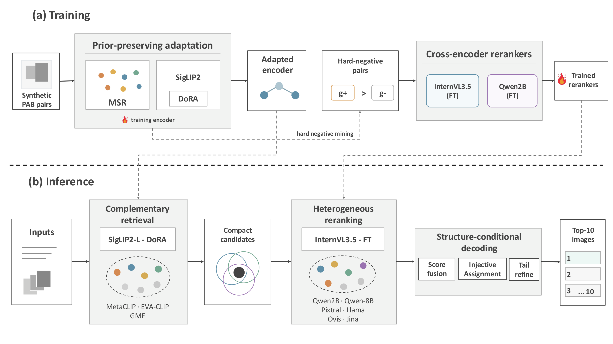

# PRC — Preserving Priors, Resolving Collisions

Complementary reranking and injective assignment for **text-based person anomaly retrieval**.
Track 4, 10th AI City Challenge · **ECCV 2026 Workshops** · Team **Xiilab.AIpex**



## 🏆 Leaderboard — 1st place

| # | Team | mAP@10 | R@1 | R@5 | R@10 |
|--:|---|--:|--:|--:|--:|
| **1** | **Xiilab.AIpex (ours)** | **99.3020** | 98.7361 | **99.9494** | **100.0000** |
| 2 | Hallucination Team | 99.2551 | 98.7867 | 99.7472 | 99.7978 |
| 3 | hiensumi | 98.3535 | 97.2194 | 99.6461 | 99.8989 |
| 4 | UIT-OpenCube | 95.9370 | 92.4166 | 99.8483 | 99.8483 |
| 5 | Safe AI | 95.9250 | 93.7310 | 98.5844 | 99.5450 |

+0.0469 mAP@10 over the second team, with **every query retrieving its target within the top 10**.

---

## Pipeline

Queries and the real gallery pass through four stages:

| stage | what it does |
|---|---|
| **S1** base retrieval | Heterogeneous encoders build a compact candidate union. |
| **S2** reranking | Cross-encoders from different families re-score that union. |
| **S3** injective assignment | Fuses the evidence and enforces one-to-one query–target correspondence. |
| **S4** tail refinement | NN completion and R@5 near-duplicate promotion, then consensus handling (a cons6 unanimity gate and a final pass). |

---

## Quick Start (reproduce)

Everything below runs without training. The replay needs no GPU.

### Install

```bash
pip install -r requirements/core.txt --extra-index-url https://download.pytorch.org/whl/cu129
```

`core.txt` is all you need to **reproduce the submission** — inference replays pre-computed
scores from `assets/cache/`, so no VLM or encoder runtime is loaded.

Extra environments are only needed to re-train or re-score:

| file | what needs it |
|---|---|
| `requirements/vllm.txt` | **`internvl_r32` (InternVL3.5-30B-A3B) — mandatory.** Its MoE takes `torch._grouped_mm` (Hopper / sm_90). On torch 2.8 every forward raises and a bare `except: continue` swallows it, so training silently completes **0 steps**. |
| `requirements/train.txt` | encoder / reranker training |
| `requirements/beit3.txt` | BEiT3 encoders (torchscale) |
| `requirements/gme.txt` · `llm2clip.txt` | those two embedders only |

### Data setup

Point `assets/data/raw/pab_test` at the Track 4 test set:

```bash
mkdir -p assets/data/raw
ln -s /path/to/name-masked_test-set  assets/data/raw/pab_test
```

The other datasets follow the same pattern. `assets/` ships empty with the clone and everything
under it is ignored by git; `requirements/setup_conda_envs.sh` creates the subdirectories.

| path | contents | needed for |
|---|---|---|
| `assets/data/raw/pab_test` | Track 4 test gallery + queries | **reproduction** |
| `assets/data/raw/pab_train` · `recaption` | PAB train split + 12-style recaptions | training |
| `assets/data/raw/{ucc,uca,rstp}` | external OOD sources (UCF-Crime-Caption · UCA · RSTPReid) | external eval |
| `assets/data/mining/` | negative caches + preference pairs (shipped) | reranker training |
| `assets/data/benches/` | evaluation benches — `ruleclean` · `ucc` · `uca` · `rstp` · `rerankstep` | test-free evaluation |
| `assets/cache/` | pre-computed stage scores — layout in [Setting](#setting--what-ships-and-where-it-must-sit) | **reproduction** |

**Evaluation** Selection never reads Track 4 labels — encoders on a 50,653-image held-out split
carved out of PAB train, rerankers on `assets/data/benches/`. The rules live in
`train/encoders/eval/eval_heldout.py` and `train/reranker/eval/eval_step.py`.

### Setting — what ships, and where it must sit

Data, caches and checkpoints are distributed outside git —
[download `assets/` here](https://drive.google.com/drive/folders/11j_Oe6Ha8Ji4WOf2hCMP51v3HKlhOu7p?usp=drive_link).
The bundle mirrors the repository layout, so each tree can be copied or symlinked into place:

| tree | contents | source |
|---|---|---|
| `assets/model/` | adopted encoder / reranker checkpoints (see *Pretrained checkpoints*) | shipped |
| `assets/cache/s1_base/` | `base_score.pt` · `union_pool.pt` · `members/` (10 encoder members) | shipped |
| `assets/cache/s2_rerank/` | 7 × `<member>_union_cache.pt` · `recs_8b_p3_k20.pt` · `recs_2b_dora_k5_p3.pt` · `fuse_cache/{internvl_r32,llama32v,pixtral}/` | shipped |
| `assets/cache/s4_nn/` | 6 tail-NN embedding files | shipped |
| `assets/cache/s4_tail/` | `{internvl_r32,jina_m0,llama}_nntail_cache.pt` | shipped |

Large files are not tracked in git — see [`ARTIFACTS.md`](ARTIFACTS.md) for the bundle, the full
`assets/` layout and its checksums. `run_reproduce.sh` verifies every path it consumes before doing
any work and names whatever is missing (`s1_base/members/` is not checked, being an input to
`build_base.py` only).

### Run reproduce

The full S1→S4 chain runs in **~16 s** on CPU and is reproducible — the same inputs always give
the same answer file.

```bash
bash run_reproduce.sh best
```

`TAG=<name>` renames the output to `answer_reproduced_<name>_noext.txt`, so runs can sit side by
side; `REDUMP_DIR=<dir>` and `BASE_PT=<file>` swap in your own reranker scores or S1 base.

### Results

The submission file is written to `results/reproduced/`:

| | |
|---|---|
| path | `results/reproduced/answer_reproduced_best_noext.txt` |
| rows | 1,978 — line *N* is the answer for line *N* of `query_index.txt` (no id column) |
| row | 10 gallery image ids, space-separated, ranked best first, without the `.jpg` extension |


## Reproducing(bulid cache)

Every artifact listed under *Setting* is regenerated from `assets/model/` and the test set, in the
order S1 members → base / union → S2 rerankers → recs · fuse_cache → S4b embeddings → S4 tail
caches. This needs GPUs; the replay above does not.

`ops/` drives it. Every script takes `DRY=1` (or `--dry-run`) to print what it would run, and
`--list` to show the per-artifact state:

```bash
bash ops/01_stage_assets.sh --check    # what is missing
bash ops/04_encode.sh --all            # 10 S1 members  → s1_base/members/
bash ops/04_encode.sh --tail           # 6 encoders     → s4_nn/
bash ops/04_encode.sh --build          # base_score.pt + union_pool.pt
bash ops/05_rerank.sh --all            # 7 S2 rerankers → s2_rerank/    ← heaviest GPU stage
bash ops/05_rerank.sh --recs           # recs_*.pt                        no GPU
bash ops/05_rerank.sh --fuse           # fuse_cache/                      no GPU
bash run_reproduce.sh best             # S3 + S4 → answer                 no GPU, ~16 s
```

Order matters in the last three: `--recs` is assembled *from* the union caches, and `--fuse` reads
the recs dump. The three `s4_tail/` nntail caches are scored afterwards from the work directory the
run leaves behind — [`ops/README.md`](ops/README.md) covers that, plus env setup (`00`), selection
(`02`) and deployment (`03`), smoke runs, slicing and reference timings.

## Pretrained checkpoints

The checkpoints below come with the Drive bundle and must sit under `assets/model/` —
[download the checkpoints here](https://drive.google.com/drive/folders/1WDqTBnwe54WKoSsdsVskTSrrqGjoELii).

### Rerankers

| member | base | adapter |
|---|---|---|
| `internvl_r32` | InternVL3.5-30B-A3B | LoRA r32 |
| `qwen3vl_2b` | Qwen3-VL-Reranker-2B | DoRA r16 |
| `jina_m0` | jina-reranker-m0 | DoRA r16 |

Adapters only — each loads on top of its base from `hf_cache/` or `vlm_models/`.

### Encoders

| member | base |
|---|---|
| `anchor_filip` (anchor) · `anchor_tcap` | SigLIP2-large-512 + DoRA |
| `metaclip2` · `mc2h378_peft` | MetaCLIP2 L/14 · huge-378 + DoRA |
| `beit3_v2` · `beit3_helip` | BEiT3-large-384, full FT |
| `metaclip_v1` | MetaCLIP v1 L/14-worldwide-xlmv (224), full FT |
| `llm2clip_lora_v3_best` + `llm2clip_anchor5` | LLM2CLIP L-14-336 + two stacked LoRAs (S4b tail-NN, not an S1 member) |

What each checkpoint directory contains: [`ARTIFACTS.md`](ARTIFACTS.md#model).

Zero-shot members (`8B` · `pixtral` · `llama` · `ovis` · `gme` · `eva02_pre` · DFN · ConvNeXt)
carry no adopted checkpoint — they use pretrained weights as published. DFN
(`DFN5B-CLIP-ViT-H-14-378`) and ConvNeXt (`CLIP-convnext_xxlarge-laion2B`) are mirrored in the
[Drive folder](https://drive.google.com/drive/folders/1WDqTBnwe54WKoSsdsVskTSrrqGjoELii), so they
can be dropped straight into `assets/model/vlm_models/`.

Checkpoints were picked on the held-out split:

```bash
python train/encoders/eval/eval_heldout.py --trainer <trainer.py> --run <run> --gpu 6
python train/reranker/eval/eval_step.py    --member dora --run <run> --steps <s1,s2,…> --gpu 7
```

### Repository layout

```
run_reproduce.sh · run_submission.py                          reproduction / inference entrypoints
pipeline/     S1_base · S2_rerank · S3_assign · S4_tail       the submitted pipeline
train/        encoders/ · reranker/ · gen/ · eval/            training & selection
tools/        ensemble/ (weight search) · promote.py          not needed to reproduce
assets/       cache/ · cache_rep/                             stage scores (adopted / reproduced)
              model/ · model_rep/                             checkpoints (adopted / reproduced)
              data/                                           raw · mining · benches · heldout_v1 · manifest
              runs/                                           training outputs (.gitignore)
results/      final/ (adopted answers) · reproduced/ (run outputs)
third_party/  beit3 (upstream, unmodified + helip · falcon · tic extensions)
docs/         fig1_pipeline.{png,pdf}
```

Members: 10 base encoders (S1) · 7 rerankers (S2–S4) · 3 embedders (S4b).
Weights live in one place — `tools/ensemble/weights/final.json`, read through
`tools/ensemble/adopted.py`.

| document | covers |
|---|---|
| [`pipeline/README.md`](pipeline/README.md) | every stage, member by member |
| `train/*/eval/*.py` docstrings | what is trained, how epochs/steps are selected |
| `requirements/setup_conda_envs.sh` | environments (one per model family) |

---


## Training

The adopted checkpoints already ship in `assets/model/`, and
`run_reproduce.sh` replays cached scores. This section is for rebuilding them from scratch.

**The Track 4 test set is never opened during training.** Encoder epochs are selected on a
held-out split carved out of PAB train (50,653 images); reranker steps on
`assets/data/benches/`.

Install the training environment first — `requirements/train.txt`, plus `requirements/vllm.txt`
for `internvl_r32` (see [Install](#install)).

### 1. Base models

Every trainer reads its base weights from the repository-local HF cache through `HF_HOME`. That
whole cache is uploaded to the
[Drive folder](https://drive.google.com/drive/folders/1WDqTBnwe54WKoSsdsVskTSrrqGjoELii) — download
`hf_cache/`, put it at `assets/model/hf_cache/`, and nothing needs fetching from the Hub:

```bash
export HF_HOME=$PWD/assets/model/hf_cache
```

To pull the repositories from the Hub yourself instead, [`ARTIFACTS.md`](ARTIFACTS.md#model) lists
every one with its `huggingface-cli` line and the exact revision this work used.

The remaining zero-shot members (`llama` · `pixtral` · `ovis` · `qwen3vl_embed8b` · `dfn` ·
`convnext`) and the `metaclip_v1` base are not fetched through `huggingface-cli`: they live as plain
directories under `VLM_MODELS`. See the `vlm_models` table in
[`ARTIFACTS.md`](ARTIFACTS.md) for the full list with sizes and sources.

`internvl_r32` reads its base from a local directory rather than the HF cache — place
InternVL3.5-30B-A3B-HF under `assets/model/vlm_models/` (override with `VLM_MODELS`).

### 2. Data

Build once; shared by every encoder and reranker.

```bash
# caption manifests — msr v1 / v2 / v1_scene
python train/gen/gen_manifest.py

# held-out split — DINOv2 near-duplicate components, group-level exclusion
python train/gen/gen_heldout_v1.py --gpu 0
```

Both skip when their output is already present; pass `--force` to rebuild.

### 3. Encoders

Each encoder follows the same five steps. The SWA range is searched on the **heldout** run —
it trained without the held-out images, so its metrics are unbiased — and applied to the
**all** run, which is the deployed model. `search_swa_range.py` prints the range to pass on.

#### anchor_filip

```bash
# 1. heldout training
python train/encoders/anchor_filip_heldout/train.py --gpu 0 \
    --run-note anchor_filip_heldout

# 2. all training
python train/encoders/anchor_filip_all/train.py --gpu 0 \
    --run-note anchor_filip_all

# 3. search the SWA range
python train/encoders/anchor_filip_heldout/search_swa_range.py \
    assets/runs/anchor_filip_heldout --gpu 0

# 4. merge — the range from step 3 (omit it to take the built-in 8 10)
python train/encoders/anchor_filip_all/build_swa.py \
    assets/runs/anchor_filip_all 8 10

# 5. deploy
python train/encoders/anchor_filip_all/deploy.py assets/runs/anchor_filip_all
```

#### anchor_tcap

```bash
# 1. heldout training
python train/encoders/anchor_tcap_heldout/train.py --gpu 1 \
    --run-note anchor_tcap_heldout

# 2. all training
python train/encoders/anchor_tcap_all/train.py --gpu 1 \
    --run-note anchor_tcap_all

# 3. search the SWA range
python train/encoders/anchor_tcap_heldout/search_swa_range.py \
    assets/runs/anchor_tcap_heldout --gpu 1

# 4. merge — the range from step 3 (omit it to take the built-in 8 10)
python train/encoders/anchor_tcap_all/build_swa.py \
    assets/runs/anchor_tcap_all 8 10

# 5. deploy
python train/encoders/anchor_tcap_all/deploy.py assets/runs/anchor_tcap_all
```

#### mc2h378_peft

```bash
# 1. heldout training
python train/encoders/mc2h378_peft_heldout/train.py --gpu 2 \
    --run-note mc2h378_peft_heldout

# 2. all training
python train/encoders/mc2h378_peft_all/train.py --gpu 2 \
    --run-note mc2h378_peft_all

# 3. search the SWA range
python train/encoders/mc2h378_peft_heldout/search_swa_range.py \
    assets/runs/mc2h378_peft_heldout --gpu 2

# 4. merge — the range from step 3 (omit it to take the built-in 2 4)
python train/encoders/mc2h378_peft_all/build_swa.py \
    assets/runs/mc2h378_peft_all 2 4

# 5. deploy
python train/encoders/mc2h378_peft_all/deploy.py assets/runs/mc2h378_peft_all
```

#### siglip_maxsim

```bash
# 1. heldout training
python train/encoders/siglip_maxsim_heldout/train.py --gpu 3 \
    --run-note siglip_maxsim_heldout

# 2. all training
python train/encoders/siglip_maxsim_all/train.py --gpu 4 \
    --run-note siglip_maxsim_all

# 3. search the SWA range
python train/encoders/siglip_maxsim_heldout/search_swa_range.py \
    assets/runs/siglip_maxsim_heldout --gpu 3

# 4. merge — the range from step 3 (no built-in default here, so it is required)
python train/encoders/siglip_maxsim_all/build_swa.py \
    assets/runs/siglip_maxsim_all <lo> <hi>

# 5. deploy
python train/encoders/siglip_maxsim_all/deploy.py assets/runs/siglip_maxsim_all
```

#### metaclip2

No `_heldout` pair, so there is no search step and the SWA range is fixed at ep02–ep04.
It trains with DDP, where the world size is part of the recipe — every LR is scaled by
`sqrt(world_size)`, so changing the GPU count changes the result.

```bash
# 1. training (5 GPUs, DDP)
python train/encoders/metaclip2/train.py --gpus 0,1,2,3,4 \
    --run-note metaclip2_all

# 2. merge — range fixed at ep02-ep04, takes no argument
python train/encoders/metaclip2/build_swa.py \
    assets/runs/metaclip2_all

# 3. deploy
python train/encoders/metaclip2/deploy.py assets/runs/metaclip2_all
```

#### beit3

Full fine-tune, so there is no SWA — the held-out run picks a best epoch and the all run adopts it.
Exclusion happens at the **index** stage rather than inside the trainer, so `--data` must point at a
`beit3_tool.py exclude` output; passing the original index stops the launch instead of silently
training on the bench. Both runs share the 4-epoch budget, which is what makes the epoch transfer.
Two of the three recipes are deployed, `v2` and `helip`; `stage1` only produces `helip`'s init.

```bash
# 1. drop the held-out images from the index (the index ships in assets/data/manifest/)
python train/encoders/beit3/beit3_tool.py exclude \
    --src assets/data/manifest/pab_v2_multi_webp \
    --dst assets/data/manifest/pab_v2_multi_webp_heldout

# 2. heldout training
python train/encoders/beit3/train.py v2 --gpu 6 \
    --data assets/data/manifest/pab_v2_multi_webp_heldout

# 3. pick the best epoch on the held-out bench
python train/encoders/beit3/beit3_tool.py eval \
    --run assets/runs/beit3_v2_heldout --epochs 0-3 --gpu 6

# 4. all training — same epoch budget, so the epoch from step 3 carries over
EXCLUDE_HELDOUT=0 python train/encoders/beit3/train.py v2 --gpu 6 \
    --data assets/data/manifest/pab_v2_multi_webp

# 5. deploy the epoch from step 3
python train/encoders/beit3/deploy.py assets/runs/beit3_v2_all --recipe v2 --epoch 3
```

The pair index (`pab_v2_multi_webp` for `v2`, `pab_full_webp` for `stage1`/`helip`) ships under
`assets/data/manifest/` — see [`ARTIFACTS.md`](ARTIFACTS.md). Rebuild it only when training on a new
recaption set: `beit3_tool.py build-index --style-mode multi --out <dir>` (`p00_original` for
`stage1`/`helip`), then symlink `train_webp` into that directory.

`helip` continues from a `stage1` checkpoint and needs its hard pairs remapped onto the filtered
index, so it adds two steps before training:

```bash
python train/encoders/beit3/train.py stage1 --gpu 6 --data <excluded pab_full_webp>
python train/encoders/beit3/beit3_tool.py remap-helip \
    --src assets/data/manifest/pab_full_webp --dst <excluded pab_full_webp>
python train/encoders/beit3/train.py helip --gpu 6 --data <excluded pab_full_webp> \
    --init assets/runs/beit3_stage1_heldout/checkpoint-3.pth
```

`--run-note` names the run directory under `assets/runs/`; an existing name aborts the launch
so two runs can never interleave their checkpoints. `deploy.py` writes to
`assets/model_rep/encoder/<encoder>/`, leaving the adopted `assets/model/` untouched.

Per-encoder configuration, inputs and switches: see the `README.md` in each
`train/encoders/<encoder>_{all,heldout}/` directory.

#### llm2clip_anchor5

Not an S1 member — it produces `anchor5_feats.pt` for S4b tail-NN. Two stacked LoRAs over
LLM2CLIP L-14-336: stage 1 the vision tower, stage 2 the text adapter on top of stage 1 merged in;
inference needs both. Steps 1 and 3 cache the Llama-8B text path — those caches ship in
`assets/data/mining/`, so the 8B model is only needed to rebuild one.

```bash
# 1. stage-1 cache -> 2. vision LoRA -> 3. stage-2 cache -> 4. text adapter
LLM2CLIP_DEV=cuda:6 python train/encoders/llm2clip_anchor5/build_text_cache.py
LLM2CLIP_DEV=cuda:6 python train/encoders/llm2clip_anchor5/train_vision.py
LLM2CLIP_DEV=cuda:6 python train/encoders/llm2clip_anchor5/build_hidden_cache.py
LLM2CLIP_DEV=cuda:6 python train/encoders/llm2clip_anchor5/train_text.py

# 5. deploy both stages
python train/encoders/llm2clip_anchor5/deploy.py \
    --vision assets/runs/llm2clip_vision_lora --text assets/runs/llm2clip_text_lora/ep03
```

Details: [`train/encoders/llm2clip_anchor5/README.md`](train/encoders/llm2clip_anchor5/README.md).

### 4. Rerankers

Each reranker mines its own negatives first, then trains, then a step is selected on
`assets/data/benches/rerankstep` and deployed. Checkpoints are written every N examples, so
the selection step picks among `ex{NNNNNN}` / `step{NNNN}` rather than epochs.

Unlike the encoders, `qwen3vl_2b` and `jina_m0` write to `$OUTPUT_DIR/runs/{timestamp}_…`, so the
run directory is only known after training starts. `<run dir>` below stands for the path the
training step prints as `[run]`. `internvl_r32` takes its path directly with `--out`.

#### qwen3vl_2b

```bash
# 1. manifest — recap positives + flip negatives (optional; shipped under assets/data/mining/)
python train/reranker/qwen3vl_2b/build_manifest.py

# 2. negcache — hard image negatives from the anchor encoder's top-1 failures
python train/reranker/qwen3vl_2b/build_negcache.py --gpu 6

# 3. train — prints the run directory as "[run] <run dir>"
OUTPUT_DIR=assets/runs/rerank_qwen3vl_2b \
    python train/reranker/qwen3vl_2b/train.py --gpu 6

# 4. select a step on the pair bench
python train/reranker/eval/eval_step.py --member dora \
    --run <run dir> --steps ex006000,ex007000,ex008000 --gpu 6

# 5. deploy
python train/reranker/qwen3vl_2b/deploy.py <run dir> --step ex007000
```

#### jina_m0

```bash
# 1. negcache — takes the qwen3vl_2b cache and appends action hard negatives
python train/reranker/jina_m0/build_negcache.py --gpu 6

# 2. train — prints the run directory as "[run] <run dir>"
OUTPUT_DIR=assets/runs/rerank_jina_m0 \
    python train/reranker/jina_m0/train.py --gpu 6

# 3. select a step on the pair bench
python train/reranker/eval/eval_step.py --member jina \
    --run <run dir> --steps ex007000,ex008000,ex009000 --gpu 6

# 4. deploy
python train/reranker/jina_m0/deploy.py <run dir> --step ex008000
```

#### internvl_r32

Preference pairs come from two opposing sources — `A_rescue` recovers base failures,
`B_antibreak` prevents the zero-shot reranker from breaking queries the base got right.
The MoE steps **require** the vLLM environment (see [Install](#install)); `eval_step.py` reads
`PY_VLLM` to pick the interpreter for the scorer it spawns.

```bash
export PY_VLLM=$(conda info --base)/envs/track4_vllm/bin/python

# 1. mine hard negatives with the SigLIP2 anchor
python train/reranker/internvl_r32/mine_hardneg.py --gpu 6 --bs 48

# 2a. A_rescue — failure-driven pairs, reuses the step-1 embedding cache
python train/reranker/internvl_r32/build_rescue_pairs.py

# 2b. B_antibreak — pairs where the zero-shot reranker breaks a correct query
$PY_VLLM train/reranker/internvl_r32/build_antibreak_pairs.py --gpu 6 --max-q 6000

# 3. train on the merged pairs
$PY_VLLM train/reranker/internvl_r32/train.py --gpu 6 \
    --out assets/runs/rerank_internvl_r32 \
    --data assets/data/mining/dpo_train.jsonl \
    --lora-r 32 --lr 1e-4 --grad-accum 8 --save-every 500

# 4. select a step on the pair bench
python train/reranker/eval/eval_step.py --member r32 \
    --run assets/runs/rerank_internvl_r32 --steps step2000,step2500,step3000 --gpu 6

# 5. deploy
python train/reranker/internvl_r32/deploy.py assets/runs/rerank_internvl_r32 --step 2500
```

Per-reranker data flow, negative construction and hyper-parameters: see the `README.md` in
each `train/reranker/<member>/` directory.

---

## Citation

```bibtex
@inproceedings{park2026prc,
  title     = {Preserving Priors, Resolving Collisions: Complementary Reranking and
               Injective Assignment for Text-Based Person Re-Identification},
  author    = {Park, Jinhee and Lee, Jihae},
  booktitle = {ECCV 2026 Workshops (10th AI City Challenge, Track 4)},
  year      = {2026}
}
```

## License

Code is released under the MIT License ([`LICENSE`](LICENSE)). Model weights are **not**
relicensed here — each backbone and reranker remains under its own terms. Vendored code from
[`microsoft/unilm`](https://github.com/microsoft/unilm) (BEiT3) is in
[`third_party/beit3/`](third_party/beit3/README.md) with its original license and
[`NOTICE`](third_party/NOTICE.md).
